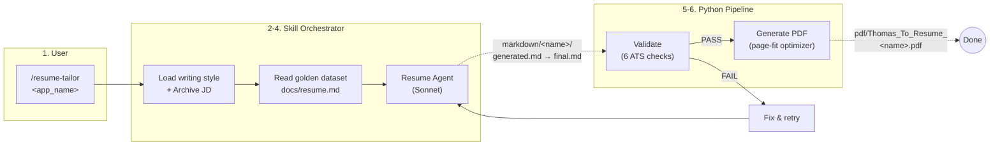
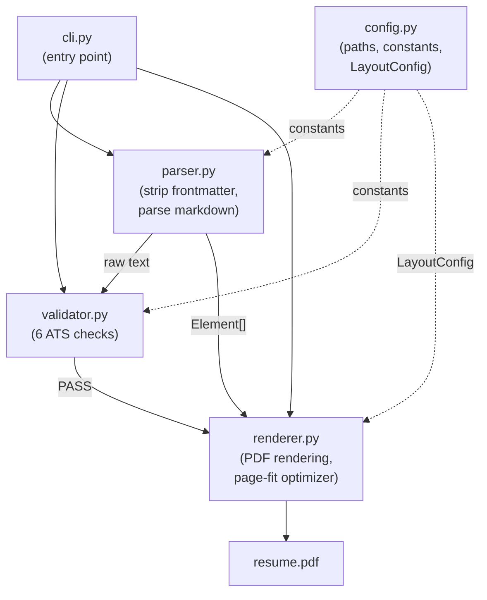
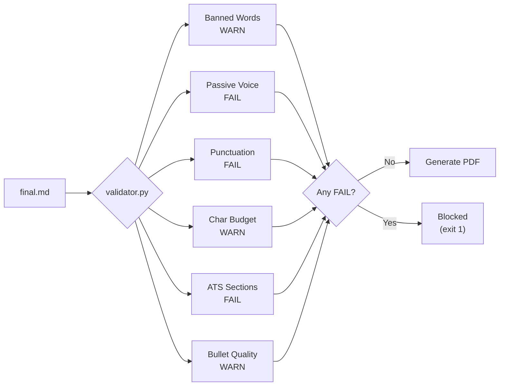

# Resume Tailor

A standalone Claude Code skill that tailors resumes to job descriptions and generates ATS-optimized single-page PDFs.

<!-- Badges -->


## Features

- **AI-powered resume tailoring** via Claude Code sub-agents with XYZ bullet formula enforcement
- **ATS compliance validation** across 6 categories: banned words, passive voice, punctuation, character budget, section headers, and bullet quality
- **Single-page PDF generation** with a 5-step auto-optimization cascade (font size, line height, spacing, margins)
- **Inline markdown rendering** in PDFs: bold, italic, and clickable links
- **Batch processing** for multiple job descriptions from the same golden dataset
- **Modular pipeline** with single-purpose Python modules (config, parser, renderer, validator, cli)
- **Three-file workflow** per application: AI baseline + editable copy + archived JD
- **Docker support** for containerized PDF generation without local Python setup

## How It Works

1. User invokes `/resume-tailor <application_name>` inside Claude Code with a job description (URL or pasted text)
2. The skill archives the JD to `markdown/<name>/jd.md` and reads the golden dataset (`docs/resume.md`)
3. A sub-agent tailors content to the JD: selects relevant roles, reframes bullets with XYZ formula, weaves in JD keywords
4. The AI output is saved as `markdown/<name>/generated.md` (immutable baseline), then copied to `final.md` (editable)
5. The validation script checks ATS compliance (FAIL-level issues block PDF generation)
6. The PDF generator produces a single-page resume to `pdf/`, auto-adjusting layout if content overflows



### Edit-Iterate Cycle

After initial generation, edit `markdown/<name>/final.md` and regenerate:

```bash
python3 scripts/resume_pdf.py --input markdown/google_mle/final.md --output Thomas_To_Resume_Google_MLE
```

The `generated.md` baseline is preserved for diff or reset.

## Tech Stack

| Component          | Technology                     |
| ------------------ | ------------------------------ |
| AI Orchestration   | Claude Code (Skills + Agents)  |
| Sub-agent Model    | Claude Sonnet                  |
| PDF Generation     | Python 3.12+, fpdf2 (>=2.8.0) |
| Containerization   | Docker (python:3.12-slim)      |

## Prerequisites

- [Claude Code](https://claude.ai/code) (CLI for resume tailoring workflow)
- [Python 3.12+](https://www.python.org/downloads/) (for PDF generation and validation)
- [Docker](https://www.docker.com/) (optional, for containerized PDF generation)

## Quick Start

### 1. Install Python Dependencies

```bash
pip install -r scripts/requirements.txt
```

### 2. Validate the Golden Dataset

```bash
python3 scripts/resume_pdf.py --validate-only
```

### 3. Tailor a Resume

Open Claude Code in this directory and run:

```
/resume-tailor google_mle
```

Paste a job description or provide a URL. Claude Code will read the golden dataset, tailor content, validate the output, and generate a PDF.

### 4. Generate a PDF from a Tailored Resume

```bash
python3 scripts/resume_pdf.py --input markdown/google_mle/final.md --output Thomas_To_Resume_Google_MLE
```

## Usage

### CLI Reference

```bash
# Validate golden dataset (no PDF output)
python3 scripts/resume_pdf.py --validate-only

# Validate a tailored resume
python3 scripts/resume_pdf.py --validate-only --input markdown/google_mle/final.md

# Generate PDF from tailored markdown
python3 scripts/resume_pdf.py --input markdown/google_mle/final.md --output Thomas_To_Resume_Google_MLE

# Generate PDF to a custom directory
python3 scripts/resume_pdf.py --input markdown/google_mle/final.md --output Thomas_To_Resume_Google_MLE --output-dir custom_dir/
```

| Flag               | Description                                    | Default                |
| ------------------ | ---------------------------------------------- | ---------------------- |
| `--input`          | Resume markdown file path                      | `docs/resume.md`      |
| `--output`         | Output PDF name (without `.pdf` extension)     | `Thomas_To_Resume`    |
| `--output-dir`     | Directory for generated PDF                    | `pdf/`                 |
| `--validate-only`  | Run validation without generating a PDF        | Off                    |

**Exit codes:** `0` = success, `1` = failure (file not found, validation FAIL, or PDF error).

### Docker

```bash
# Build the image
docker compose build

# Validate the golden dataset
docker compose run resume-pdf --validate-only

# Generate a PDF
docker compose run resume-pdf --input markdown/google_mle/final.md --output Thomas_To_Resume_Google_MLE
```

The Docker image uses `python:3.12-slim` and mounts the project directory as a volume for host file access.

### Batch Processing

Each invocation reads the same immutable golden dataset and writes to independent output folders. Run multiple tailoring sessions for different roles:

```
/resume-tailor google_mle
/resume-tailor stripe_ai_engineer
/resume-tailor anthropic_swe
```

Recommendation to use claude-code or AI web extension to scrape, and clean each tab separated by commas.

## Project Structure

```
resume/
├── CLAUDE.md                                    # Project instructions for Claude Code
├── README.md                                    # This file
├── Dockerfile                                   # Python 3.12 + fpdf2
├── docker-compose.yml                           # Single-service Docker setup
├── .gitignore                                   # Ignores generated output
│
├── .claude/
│   ├── skills/resume-tailor/SKILL.md            # 7-step skill orchestrator
│   └── agents/resume.md                         # Resume tailoring sub-agent (Sonnet)
│
├── docs/                                        # IMMUTABLE, READ-ONLY golden datasets
│   ├── resume.md                                # Golden dataset (never modified)
│   └── writing_style_guide.md                   # Writing style rules
│
├── scripts/                                     # Python pipeline
│   ├── requirements.txt                         # Python deps (fpdf2>=2.8.0)
│   ├── resume_pdf.py                            # CLI entry point (thin wrapper)
│   └── pipeline/                                # Modular pipeline package
│       ├── __init__.py                          # Package init
│       ├── config.py                            # Paths, constants, LayoutConfig
│       ├── parser.py                            # Markdown parsing
│       ├── renderer.py                          # PDF rendering + optimization
│       ├── validator.py                         # ATS validation checks
│       └── cli.py                               # Argument parsing, logging, main()
│
├── markdown/                                    # Generated markdown output
│   └── {company_role}/                          # One subfolder per application
│       ├── jd.md                                # Archived job description
│       ├── generated.md                         # AI-generated resume (baseline)
│       └── final.md                             # Editable copy for iteration
│
└── pdf/                                         # Generated PDF output
    └── Thomas_To_Resume_{Company_Role}.pdf      # Built from final.md
```

## Pipeline Modules

The Python pipeline (`scripts/pipeline/`) is organized into single-purpose modules:



| Module         | Responsibility |
| -------------- | -------------- |
| `config.py`    | Project paths, layout constants, type aliases, `LayoutConfig` dataclass, `ensure_dirs()` |
| `parser.py`    | Frontmatter stripping, inline markdown parsing, resume element recognition |
| `renderer.py`  | PDF element rendering (H1, H2, bullets, etc.), page-fit optimization, PDF generation |
| `validator.py` | Banned words, passive voice, punctuation, character budget, ATS sections, bullet quality |
| `cli.py`       | Argument parsing, logging setup, orchestration of validate -> parse -> generate |

## Validation

The validation pipeline runs 6 checks before PDF generation. Any **FAIL**-level issue blocks PDF output.

| Category           | Severity | Description                                                    |
| ------------------ | -------- | -------------------------------------------------------------- |
| Banned Words       | WARN     | Flags 79 AI-sounding words (e.g., "delve", "utilize")         |
| Passive Voice      | FAIL     | Detects "was/were/been/being + past participle" constructions  |
| Punctuation        | FAIL     | Rejects em dashes, double hyphens, and semicolons              |
| Character Budget   | WARN     | Targets 4,500-5,000 visible characters for single-page fit    |
| ATS Sections       | FAIL     | Requires exactly 4 H2 headers (see Key Concepts below)        |
| Bullet Quality     | WARN     | Flags bullets missing quantified metrics (XYZ Y-component)     |



**Severity levels:**

- **PASS** `[+]` -- Check succeeded
- **WARN** `[!]` -- Advisory; does not block PDF generation
- **FAIL** `[x]` -- Blocks PDF generation; must be resolved

## Key Concepts

- **Golden Dataset**: `docs/resume.md` is the single source of truth. It contains the full professional history and is never modified by any skill, agent, or script.
- **XYZ Bullet Formula**: Every bullet follows "Accomplished [X] as measured by [Y], by doing [Z]". X = result, Y = metric, Z = method.
- **ATS Sections**: Only four H2 headers are permitted: `PROFESSIONAL SUMMARY`, `TECHNICAL SKILLS`, `PROFESSIONAL EXPERIENCE`, `EDUCATION`.
- **Character Budget**: Tailored resumes target 4,500-5,000 visible characters for single-page PDF fit.
- **Banned Words**: A curated list of 79 AI-sounding and filler words is enforced during validation.
- **Page-Fit Optimizer**: A 5-step cascade that progressively tightens font size, line height, spacing, and margins until the PDF fits on one page.
- **Three-File Workflow**: Each application folder contains `jd.md` (archived JD), `generated.md` (AI baseline), and `final.md` (editable copy for iteration).

## Contributing

1. Never modify `docs/resume.md` (the golden dataset is read-only)
2. Follow the development directives in `CLAUDE.md`
3. Run `python3 scripts/resume_pdf.py --validate-only` before submitting changes
4. All validation rules must remain generic and pattern-based (no hardcoded values)
