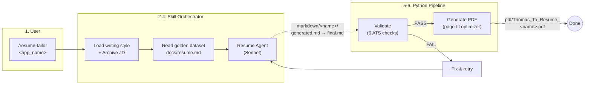
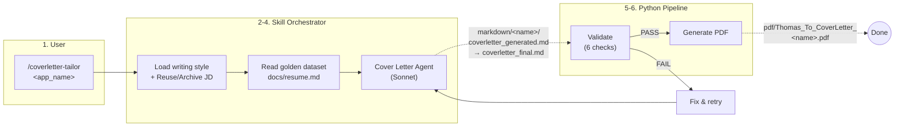
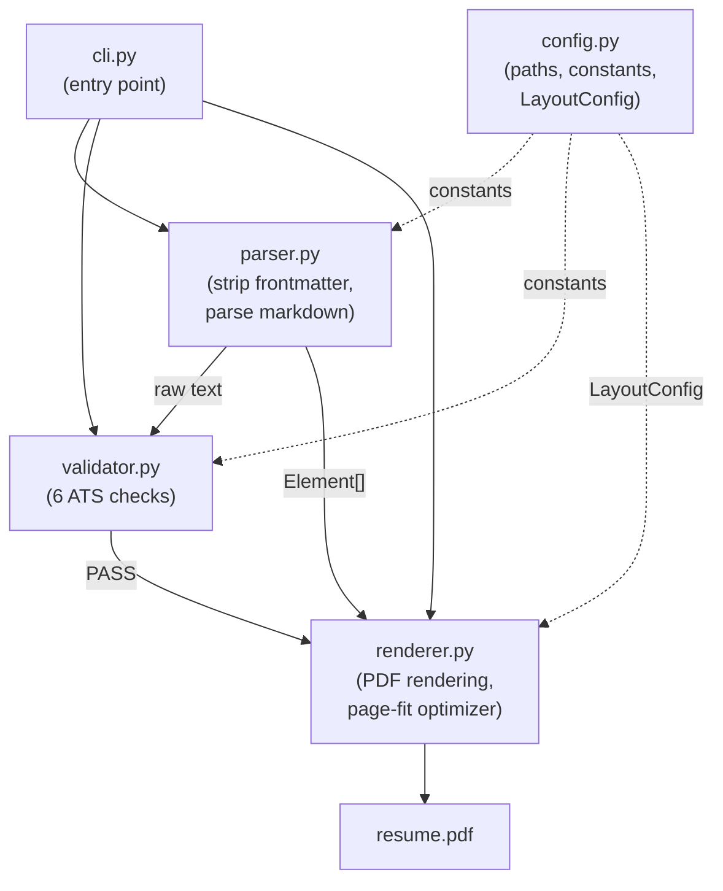
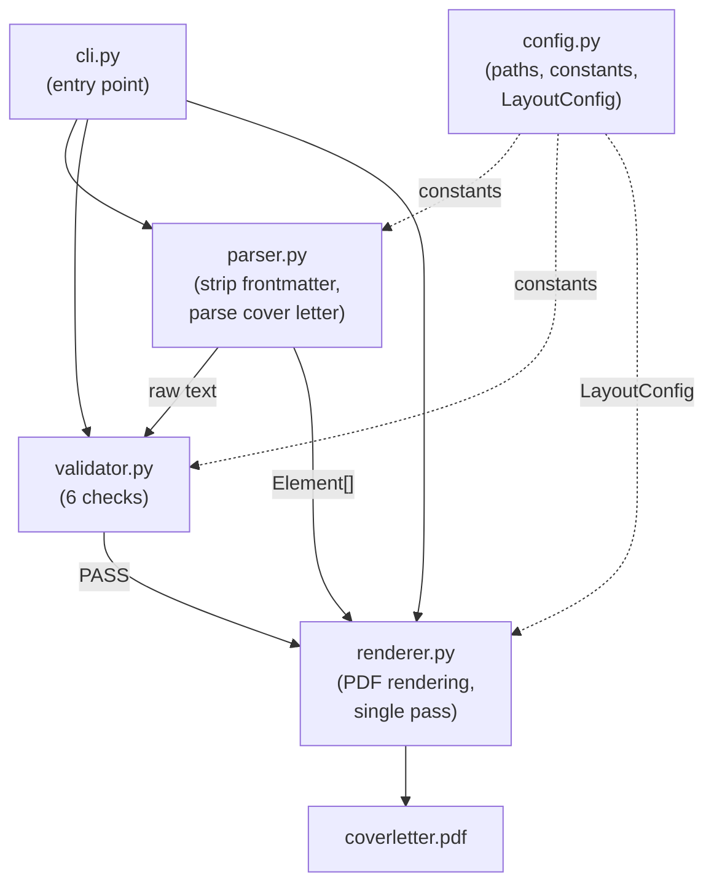
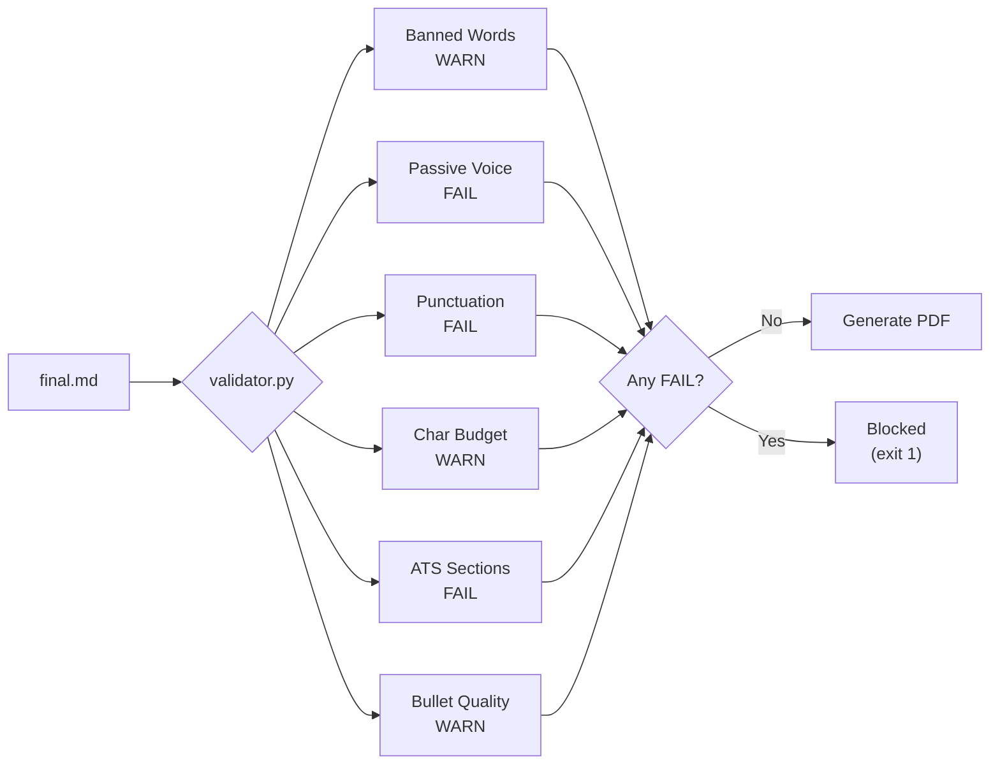
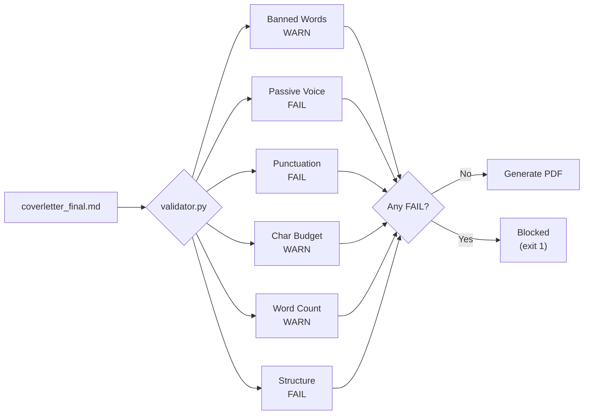

# Resume & Cover Letter Tailor

A standalone Claude Code skill that tailors resumes and cover letters to job descriptions and generates ATS-optimized single-page PDFs.

<!-- Badges -->


## Features

### Resume
- **AI-powered resume tailoring** via Claude Code sub-agents with XYZ bullet formula enforcement
- **ATS compliance validation** across 6 categories: banned words, passive voice, punctuation, character budget, section headers, and bullet quality
- **Single-page PDF generation** with a 5-step auto-optimization cascade (font size, line height, spacing, margins)
- **Inline markdown rendering** in PDFs: bold, italic, and clickable links
- **Batch processing** for multiple job descriptions from the same golden dataset
- **Modular pipeline** with single-purpose Python modules (config, parser, renderer, validator, cli)
- **Three-file workflow** per application: AI baseline + editable copy + archived JD
- **Docker support** for containerized PDF generation without local Python setup

### Cover Letter
- **AI-powered cover letter generation** via Claude Code sub-agents with narrative paragraph structure
- **JD keyword extraction** and natural integration into body paragraphs
- **Structural validation** across 6 checks: banned words, passive voice, punctuation, character budget, word count, and structure (greeting, signature, no bullets, paragraph count)
- **JD reuse**: automatically reuses `jd.md` from a prior `/resume-tailor` run, avoiding duplicate extraction
- **Two-file workflow** per application: AI baseline (`coverletter_generated.md`) + editable copy (`coverletter_final.md`)
- **Single-page PDF** with Times font, letter format, and professional layout (no page-fit optimizer needed for 250-400 word documents)

## How It Works

### Resume Workflow

1. User invokes `/resume-tailor <application_name>` inside Claude Code with a job description (URL or pasted text)
2. The skill archives the JD to `markdown/<name>/jd.md` and reads the golden dataset (`docs/resume.md`)
3. A sub-agent tailors content to the JD: selects relevant roles, reframes bullets with XYZ formula, weaves in JD keywords
4. The AI output is saved as `markdown/<name>/generated.md` (immutable baseline), then copied to `final.md` (editable)
5. The validation script checks ATS compliance (FAIL-level issues block PDF generation)
6. The PDF generator produces a single-page resume to `pdf/`, auto-adjusting layout if content overflows



### Cover Letter Workflow

1. User invokes `/coverletter-tailor <application_name>` inside Claude Code
2. The skill checks for an existing `markdown/<name>/jd.md` (reuses from `/resume-tailor`) or extracts a new JD
3. A sub-agent generates a narrative cover letter: selects 2-3 relevant roles, weaves JD keywords into paragraphs, includes metrics
4. The AI output is saved as `markdown/<name>/coverletter_generated.md` (baseline), then copied to `coverletter_final.md` (editable)
5. The validation script checks structure and writing quality (FAIL-level issues block PDF generation)
6. The PDF generator produces a single-page cover letter to `pdf/`



### Edit-Iterate Cycle

After initial generation, edit the `final.md` (resume) or `coverletter_final.md` (cover letter) and regenerate:

```bash
# Resume
python3 scripts/resume_pdf.py --input markdown/google_mle/final.md --output Thomas_To_Resume_Google_MLE

# Cover letter
python3 scripts/coverletter_pdf.py --input markdown/google_mle/coverletter_final.md --output Thomas_To_CoverLetter_Google_MLE
```

The `generated.md` and `coverletter_generated.md` baselines are preserved for diff or reset.

## Tech Stack

| Component          | Technology                     |
| ------------------ | ------------------------------ |
| AI Orchestration   | Claude Code (Skills + Agents)  |
| Sub-agent Model    | Claude Sonnet                  |
| PDF Generation     | Python 3.12+, fpdf2 (>=2.8.0) |
| Containerization   | Docker (python:3.12-slim)      |

## Prerequisites

- [Claude Code](https://claude.ai/code) (CLI for resume and cover letter tailoring workflows)
- [Python 3.12+](https://www.python.org/downloads/) (for PDF generation and validation)
- [Docker](https://www.docker.com/) (optional, for containerized PDF generation)

## Quick Start

### 1. Install Python Dependencies

```bash
pip install -r scripts/requirements.txt
```

### 2. Validate the Golden Dataset

```bash
python3 scripts/resume_pdf.py --validate-only
```

### 3. Tailor a Resume

Open Claude Code in this directory and run:

```
/resume-tailor google_mle
```

Paste a job description or provide a URL. Claude Code will read the golden dataset, tailor content, validate the output, and generate a PDF.

### 4. Generate a PDF from a Tailored Resume

```bash
python3 scripts/resume_pdf.py --input markdown/google_mle/final.md --output Thomas_To_Resume_Google_MLE
```

### 5. Generate a Cover Letter

With the same application folder (reuses the JD from step 3):

```
/coverletter-tailor google_mle
```

Claude Code will reuse the existing `jd.md`, generate a narrative cover letter, validate it, and produce a PDF.

### 6. Generate a PDF from a Tailored Cover Letter

```bash
python3 scripts/coverletter_pdf.py --input markdown/google_mle/coverletter_final.md --output Thomas_To_CoverLetter_Google_MLE
```

## Usage

### Resume CLI Reference

```bash
# Validate golden dataset (no PDF output)
python3 scripts/resume_pdf.py --validate-only

# Validate a tailored resume
python3 scripts/resume_pdf.py --validate-only --input markdown/google_mle/final.md

# Generate PDF from tailored markdown
python3 scripts/resume_pdf.py --input markdown/google_mle/final.md --output Thomas_To_Resume_Google_MLE

# Generate PDF to a custom directory
python3 scripts/resume_pdf.py --input markdown/google_mle/final.md --output Thomas_To_Resume_Google_MLE --output-dir custom_dir/
```

| Flag               | Description                                    | Default                |
| ------------------ | ---------------------------------------------- | ---------------------- |
| `--input`          | Resume markdown file path                      | `docs/resume.md`      |
| `--output`         | Output PDF name (without `.pdf` extension)     | `Thomas_To_Resume`    |
| `--output-dir`     | Directory for generated PDF                    | `pdf/`                 |
| `--validate-only`  | Run validation without generating a PDF        | Off                    |

### Cover Letter CLI Reference

```bash
# Validate a cover letter
python3 scripts/coverletter_pdf.py --validate-only --input markdown/google_mle/coverletter_final.md

# Generate PDF from cover letter markdown
python3 scripts/coverletter_pdf.py --input markdown/google_mle/coverletter_final.md --output Thomas_To_CoverLetter_Google_MLE

# Generate PDF to a custom directory
python3 scripts/coverletter_pdf.py --input markdown/google_mle/coverletter_final.md --output Thomas_To_CoverLetter_Google_MLE --output-dir custom_dir/
```

| Flag               | Description                                         | Default                    |
| ------------------ | --------------------------------------------------- | -------------------------- |
| `--input`          | Cover letter markdown file path (**required**)       | None                       |
| `--output`         | Output PDF name (without `.pdf` extension)           | `Thomas_To_CoverLetter`   |
| `--output-dir`     | Directory for generated PDF                          | `pdf/`                     |
| `--validate-only`  | Run validation without generating a PDF              | Off                        |

**Exit codes (both CLIs):** `0` = success, `1` = failure (file not found, validation FAIL, or PDF error).

### Docker

```bash
# Build the image
docker compose build

# Validate the golden dataset
docker compose run resume-pdf --validate-only

# Generate a resume PDF
docker compose run resume-pdf --input markdown/google_mle/final.md --output Thomas_To_Resume_Google_MLE
```

The Docker image uses `python:3.12-slim` and mounts the project directory as a volume for host file access.

> **Note:** The Docker service currently supports the resume pipeline only. Run the cover letter pipeline directly with Python.

### Batch Processing

Each invocation reads the same immutable golden dataset and writes to independent output folders. Run multiple tailoring sessions for different roles:

```
/resume-tailor google_mle
/resume-tailor stripe_ai_engineer
/resume-tailor anthropic_swe
```

Then generate cover letters for any or all of them (reuses the archived JD):

```
/coverletter-tailor google_mle
/coverletter-tailor stripe_ai_engineer
/coverletter-tailor anthropic_swe
```

Recommendation to use claude-code or AI web extension to scrape, and clean each tab separated by commas.

## Project Structure

```
resume/
├── CLAUDE.md                                    # Project instructions for Claude Code
├── README.md                                    # This file
├── Dockerfile                                   # Python 3.12 + fpdf2
├── docker-compose.yml                           # Single-service Docker setup
├── .gitignore                                   # Ignores generated output
│
├── .claude/
│   ├── skills/
│   │   ├── resume-tailor/SKILL.md               # 7-step resume skill orchestrator
│   │   └── coverletter-tailor/SKILL.md          # 7-step cover letter skill orchestrator
│   └── agents/
│       ├── resume.md                            # Resume tailoring sub-agent (Sonnet)
│       └── coverletter.md                       # Cover letter tailoring sub-agent (Sonnet)
│
├── docs/                                        # IMMUTABLE, READ-ONLY golden datasets
│   ├── resume.md                                # Golden dataset (never modified)
│   └── writing_style_guide.md                   # Writing style rules
│
├── scripts/                                     # Python pipelines
│   ├── requirements.txt                         # Python deps (fpdf2>=2.8.0)
│   ├── resume_pdf.py                            # Resume CLI entry point (thin wrapper)
│   ├── resume_pipeline/                         # Resume pipeline package
│   │   ├── __init__.py                          # Package init
│   │   ├── config.py                            # Paths, constants, LayoutConfig
│   │   ├── parser.py                            # Markdown parsing
│   │   ├── renderer.py                          # PDF rendering + page-fit optimizer
│   │   ├── validator.py                         # ATS validation checks
│   │   └── cli.py                               # Argument parsing, logging, main()
│   ├── coverletter_pdf.py                       # Cover letter CLI entry point (thin wrapper)
│   └── coverletter_pipeline/                    # Cover letter pipeline package
│       ├── __init__.py                          # Package init
│       ├── config.py                            # Paths, constants, LayoutConfig
│       ├── parser.py                            # Markdown parsing (paragraphs, greeting, signature)
│       ├── renderer.py                          # PDF rendering (single pass, no optimizer)
│       ├── validator.py                         # Writing quality + structural validation
│       └── cli.py                               # Argument parsing, logging, main()
│
├── markdown/                                    # Generated markdown output
│   └── {company_role}/                          # One subfolder per application
│       ├── jd.md                                # Archived job description (shared)
│       ├── generated.md                         # AI-generated resume (baseline)
│       ├── final.md                             # Editable resume copy for iteration
│       ├── coverletter_generated.md             # AI-generated cover letter (baseline)
│       └── coverletter_final.md                 # Editable cover letter copy for iteration
│
└── pdf/                                         # Generated PDF output
    ├── Thomas_To_Resume_{Company_Role}.pdf      # Built from final.md
    └── Thomas_To_CoverLetter_{Company_Role}.pdf # Built from coverletter_final.md
```

## Pipeline Modules

### Resume Pipeline

The resume pipeline (`scripts/resume_pipeline/`) is organized into single-purpose modules:



| Module         | Responsibility |
| -------------- | -------------- |
| `config.py`    | Project paths, layout constants, type aliases, `LayoutConfig` dataclass, `ensure_dirs()` |
| `parser.py`    | Frontmatter stripping, inline markdown parsing, resume element recognition |
| `renderer.py`  | PDF element rendering (H1, H2, bullets, etc.), page-fit optimization, PDF generation |
| `validator.py` | Banned words, passive voice, punctuation, character budget, ATS sections, bullet quality |
| `cli.py`       | Argument parsing, logging setup, orchestration of validate -> parse -> generate |

### Cover Letter Pipeline

The cover letter pipeline (`scripts/coverletter_pipeline/`) mirrors the resume pipeline structure with cover-letter-specific logic:



| Module         | Responsibility |
| -------------- | -------------- |
| `config.py`    | Project paths, layout constants, type aliases, `LayoutConfig` dataclass, `ensure_dirs()` |
| `parser.py`    | Frontmatter stripping, inline markdown parsing, cover letter element recognition (h1, contact, date, greeting, paragraph, signature) |
| `renderer.py`  | PDF element rendering (H1, contact, date, greeting, paragraphs, signature block), single-pass generation (no page-fit optimizer needed) |
| `validator.py` | Banned words, passive voice, punctuation, character budget (1500-2500), word count (250-400), structural checks (greeting, signature, no bullets, paragraph count) |
| `cli.py`       | Argument parsing, logging setup, orchestration of validate -> parse -> generate |

## Validation

### Resume Validation

The resume validation pipeline runs 6 checks before PDF generation. Any **FAIL**-level issue blocks PDF output.

| Category           | Severity | Description                                                    |
| ------------------ | -------- | -------------------------------------------------------------- |
| Banned Words       | WARN     | Flags 79 AI-sounding words (e.g., "delve", "utilize")         |
| Passive Voice      | FAIL     | Detects "was/were/been/being + past participle" constructions  |
| Punctuation        | FAIL     | Rejects em dashes, double hyphens, and semicolons              |
| Character Budget   | WARN     | Targets 4,500-5,000 visible characters for single-page fit    |
| ATS Sections       | FAIL     | Requires exactly 4 H2 headers (see Key Concepts below)        |
| Bullet Quality     | WARN     | Flags bullets missing quantified metrics (XYZ Y-component)     |



### Cover Letter Validation

The cover letter validation pipeline runs 6 checks before PDF generation. Any **FAIL**-level issue blocks PDF output.

| Category           | Severity | Description                                                          |
| ------------------ | -------- | -------------------------------------------------------------------- |
| Banned Words       | WARN     | Flags AI-sounding words (same curated list as resume)                |
| Passive Voice      | FAIL     | Detects "was/were/been/being + past participle" constructions        |
| Punctuation        | FAIL     | Rejects em dashes, double hyphens, and semicolons                    |
| Character Budget   | WARN     | Targets 1,500-2,500 visible characters                              |
| Word Count         | WARN     | Targets 250-400 words                                                |
| Structure          | FAIL     | Requires greeting ("Dear ...,"), signature ("Sincerely,"), no bullet points, and at least 2 body paragraphs |



**Severity levels (both pipelines):**

- **PASS** `[+]` -- Check succeeded
- **WARN** `[!]` -- Advisory; does not block PDF generation
- **FAIL** `[x]` -- Blocks PDF generation; must be resolved

## Key Concepts

### Shared
- **Golden Dataset**: `docs/resume.md` is the single source of truth. It contains the full professional history and is never modified by any skill, agent, or script.
- **Banned Words**: A curated list of 79 AI-sounding and filler words is enforced during validation for both resumes and cover letters.
- **Three Severity Levels**: PASS (check succeeded), WARN (advisory), FAIL (blocks PDF output).

### Resume
- **XYZ Bullet Formula**: Every bullet follows "Accomplished [X] as measured by [Y], by doing [Z]". X = result, Y = metric, Z = method.
- **ATS Sections**: Only four H2 headers are permitted: `PROFESSIONAL SUMMARY`, `TECHNICAL SKILLS`, `PROFESSIONAL EXPERIENCE`, `EDUCATION`.
- **Character Budget (Resume)**: Tailored resumes target 4,500-5,000 visible characters for single-page PDF fit.
- **Page-Fit Optimizer**: A 5-step cascade that progressively tightens font size, line height, spacing, and margins until the PDF fits on one page.
- **Three-File Workflow**: Each application folder contains `jd.md` (archived JD), `generated.md` (AI baseline), and `final.md` (editable copy for iteration).

### Cover Letter
- **Narrative Paragraph Structure**: Cover letters use flowing paragraphs (no bullet points). The agent selects 2-3 relevant roles and weaves JD keywords into natural sentences.
- **JD Reuse**: The cover letter skill checks for an existing `markdown/<name>/jd.md` from a prior `/resume-tailor` run, avoiding duplicate extraction.
- **Character Budget (Cover Letter)**: Targets 1,500-2,500 visible characters (250-400 words) for single-page fit.
- **Structural Requirements**: A valid cover letter must include a greeting ("Dear ..."), a signature block ("Sincerely,"), no bullet points, and at least 2 body paragraphs.
- **Two-File Workflow**: Each application folder adds `coverletter_generated.md` (AI baseline) and `coverletter_final.md` (editable copy for iteration), alongside the shared `jd.md`.

## Contributing

1. Never modify `docs/resume.md` (the golden dataset is read-only)
2. Follow the development directives in `CLAUDE.md`
3. Run `python3 scripts/resume_pdf.py --validate-only` before submitting changes to the resume pipeline
4. Run `python3 scripts/coverletter_pdf.py --validate-only --input <file>` before submitting changes to the cover letter pipeline
5. All validation rules must remain generic and pattern-based (no hardcoded values)
